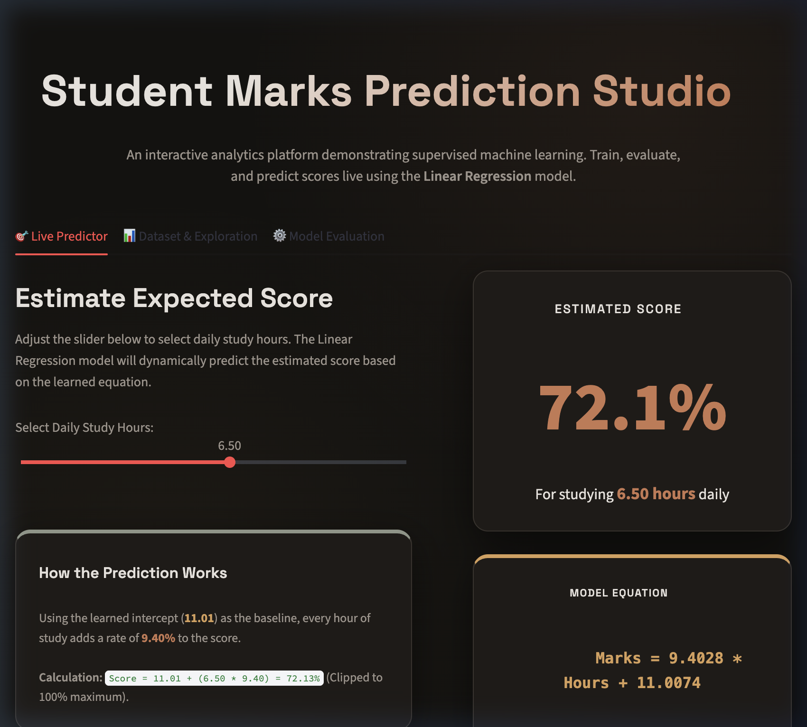
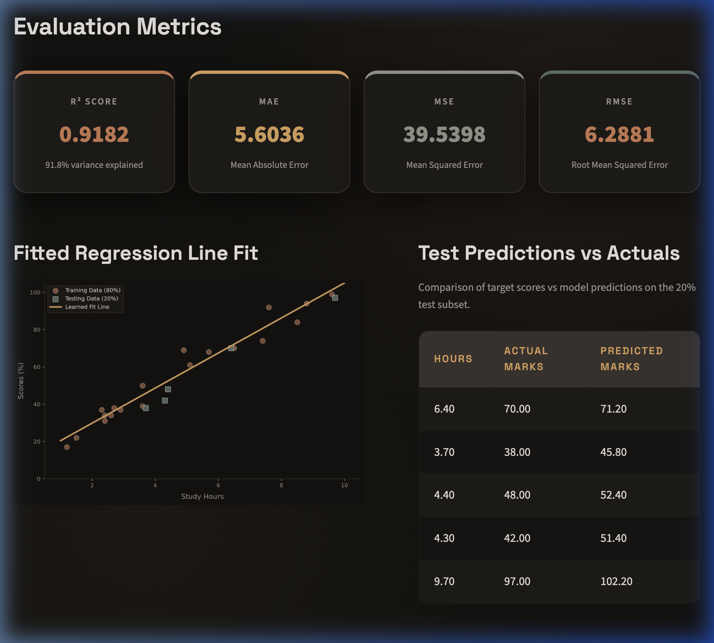
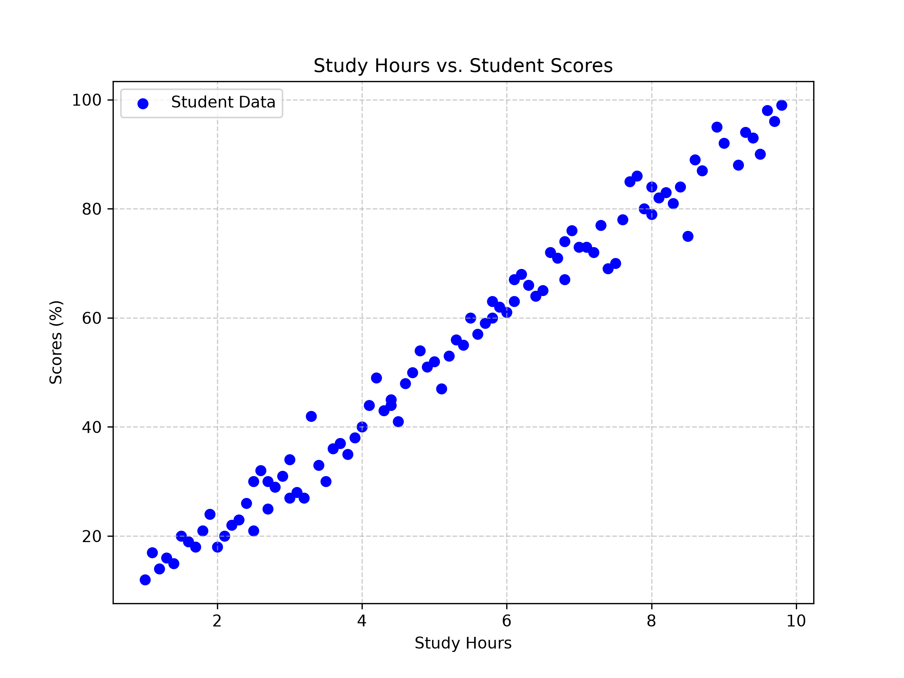
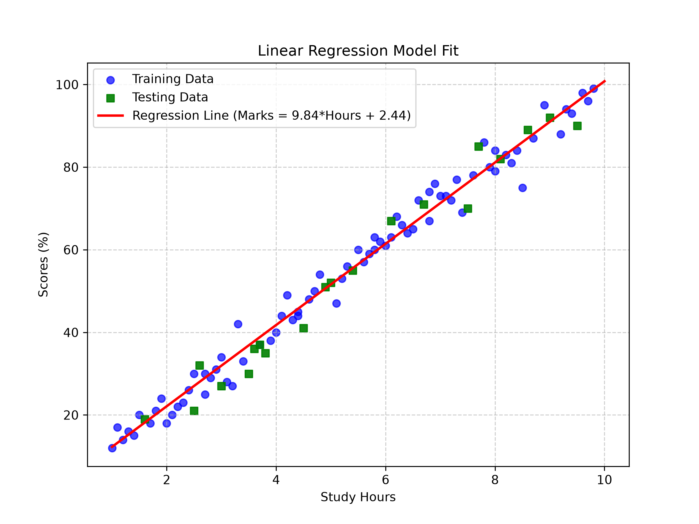

# Student Marks Prediction Studio

A professional machine learning regression implementation that predicts student marks based on daily study hours. Built on a real-world dataset, the project fits a Linear Regression model, analyzes statistical error metrics, and provides both a local Streamlit dashboard and a Vercel-ready serverless web interface.

---

## Design System

The application features a custom, modern **Espresso & Terracotta (Warm-Toned Dark Mode)** design system. This avoids generic "AI templates" in favor of organic, warm tones inspired by high-end design portfolios:
- **Base Background**: Deep Espresso Brown-Black (`#141210`) with ambient warm copper glows.
- **Card Surfaces**: Roasted Coffee / Warm Charcoal (`#1E1B18`) panels.
- **Borders**: Thin Muted Sand (`#3A342E`) strokes.
- **Typography**: Space Grotesk (headers) in Warm Linen (`#E8E3DD`) and Jakarta Sans (body) in Muted Pebble (`#9D948C`).
- **Signature Accents**: Terracotta Clay (`#C97A53`), Muted Ochre (`#D9A05B`), and Slate Green (`#5D7068`).

---

## Technologies Used
- **Python**: Core programming language.
- **Pandas & NumPy**: Data loading, array operations, and preprocessing.
- **Scikit-learn**: Split-validation and model training (`LinearRegression`).
- **Matplotlib & Chart.js**: Fully styled analytical visualizations.
- **Streamlit**: Interactive local visual dashboard.
- **Flask**: Serverless REST API backend.
- **Vercel**: Serverless hosting.

---

## Key Features
- **Real-World Modeling**: Trained on student hours and performance records.
- **Interactive Predictor Slider**: Adjust daily study hours to immediately calculate the predicted score.
- **Model Evaluation KPIs**: Real-time display of $R^2$, MAE, MSE, and RMSE scores.
- **Interactive & Static Charting**: Renders clean, styled charts showcasing historical points, validation splits, and fit lines.
- **Two Deployment Modes**: Runs locally via Streamlit, and deploys serverlessly to Vercel via Flask/HTML.
- **Clean Structure**: Zero unnecessary abstractions, keeping the implementation readable and fast.

---

## Project Structure
```text
student_marks_prediction/
├── api/
│   └── index.py                 # Flask serverless API backend (Vercel)
├── data/
│   └── student_scores.csv       # Prepared dataset (96 records)
├── gallery/
│   ├── dashboard_home.png       # Live Predictor view screenshot
│   └── dashboard_evaluation.png # Model Evaluation view screenshot
├── outputs/
│   ├── 1_scatter_plot.png       # Static scatter plot (Hours vs Scores)
│   └── 2_regression_line.png    # Static regression fit line plot
├── public/
│   └── index.html               # Single-page HTML/CSS/JS frontend (Vercel)
├── src/
│   ├── generate_dataset.py      # Dataset loader and preparation script
│   ├── marks_prediction.py      # Core regression evaluation pipeline
│   └── dashboard.py             # Streamlit local dashboard script
├── .gitignore                 # Version control ignores (ignores screenshots)
├── requirements.txt           # Unified python requirements
├── vercel.json                # Vercel deployment router
├── run_project.sh             # Interactive local project launcher
└── README.md                  # Project documentation
```

---

## How to Run

### ⚡ Shortcut: Run Everything Locally
You can run the entire pipeline (verifying packages, preparing the data, running evaluation, and launching the local Streamlit dashboard) using the automated runner script:
```bash
./run_project.sh
```

---

### 🛠️ Manual Instructions

#### 1. Install Dependencies
```bash
pip install -r requirements.txt
```

#### 2. Prepare the Dataset
Loads the dataset from the archive and saves it to the standard data path:
```bash
python src/generate_dataset.py
```

#### 3. Run the ML Pipeline (Terminal Mode)
Train the regression model and output summary metrics inside your console:
```bash
python src/marks_prediction.py
```

#### 4. Run the Streamlit Dashboard (Local Web App)
```bash
streamlit run src/dashboard.py
```

#### 5. Run the Flask Web App (Local Serverless Mock)
```bash
python api/index.py
```
Open `http://localhost:5000` in your web browser.

---

### ☁️ Vercel Serverless Deployment
To publish the HTML/Flask dashboard online for free:
1. Install Vercel CLI: `npm install -g vercel`
2. Run `vercel` in the project root and follow the terminal prompts to link and deploy your project.

---

## Model Performance & Metrics

### Learned Model Equation
The trained Linear Regression model fits the line:
$$\text{Marks} = 9.8356 \times \text{Hours} + 2.4406$$
- **Slope ($9.8356$)**: For every additional study hour daily, exam marks are predicted to increase by approximately **9.84%**.
- **Intercept ($2.4406$)**: Represents the base mark baseline (2.44%) for a student studying 0 hours.

### Metrics on Validation Partition (20% Test Split)
- **Coefficient of Determination ($R^2$ Score)**: `0.9709` (97.1% of scores variance is explained by study hours).
- **Mean Absolute Error (MAE)**: `3.3702` marks.
- **Mean Squared Error (MSE)**: `17.0074` marks².
- **Root Mean Squared Error (RMSE)**: `4.1240` marks.

### Test Set Actual vs Predicted Table
```text
 Hours  Actual Marks  Predicted Marks
   2.6            32             28.0
   4.9            51             50.6
   3.0            27             31.9
   3.7            37             38.8
   8.1            82             82.1
   8.6            89             87.0
   7.5            70             76.2
   6.7            71             68.3
```

---

## Gallery

### 1. Interactive Live Predictor Dashboard
The landing page panel displaying dynamic model predictions and equation parameters:


### 2. Model Evaluation Dashboard Tab
The evaluation metrics cards, fitted regression plot, and actual-vs-predicted comparison:


### 3. Matplotlib Exploratory Analysis (Static Plots)
The static plots generated by the python pipeline during model evaluation:
- **Dataset Correlation**:

- **Regression Fit Line**:

